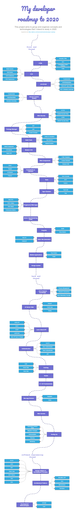

# My developer roadmap to 2020
This project aims to group and organize concepts and technologies that I intend to study in 2020. 

Inspired by the [kamranahmedse/developer-roadmap](https://github.com/kamranahmedse/developer-roadmap)

## Front End Thread

1.  <b>HTML</b>
    - Semantic HTML
    - SEO
    - Conventions & Best Pratices
    - DOM
1.  <b>CSS</b>
    - Media Queries
    - Grid System
    - CSS Architecture
    - CSS Preprocessor
1.  <b>JavaScript</b>
    - Fundamentals
    - DOM Manipulation
    - Fetch API \ AJAX (XRH)
    - ES6+ & Modular JavaScript
1.  <b>Version Control System</b>
    - Fundamentals
    - Branching Model
    - Semantic Versioning
1.  <b>Web Security</b>
    - HTTPS
    - Content Security Policy
    - Cors
    - OWASP Security Risks
1.  <b>Package Manager</b>
    - npm
    - yarn
    - Private Packages
1.  <b>Build Tools</b>
    - Lint & Formaters
    - Tasks Runners
    - Module Bundlers
1.  <b>Modern CSS</b>
    - Styled Components
    - CSS Module
    - Styled JSX
1.  <b>Web Components</b>
    - HTML Templates
    - Custom Elements
    - Shadow DOM
1.  <b>Framework & Libraries</b>
    - Angular
    - React
    - Lit Element
    - Polymer
1.  <b>Tests</b>
    - Tests Concepts
    - JEST
    - Cypress
1.  <b>Type Checkers</b>
    - Typescript
    - Flow
1.  <b>Progressive Web APP</b>
    - Web APIs
    - PRPL Pattern
    - RAIL Model
    - Performance Metrics
1.  <b>Server Side Rendering (SSR)</b>
1.  <b>GraphQL</b>
    - Apollo
    - Relay Modern
1.  <b>Static Site Generators</b>
    - Next.js
    - GatsbyJS
1.  <b>Mobile Applications</b>
    - React Native
    - Flutter
1.  <b>Design System</b>

## Back End Thread
1.  <b>OS & General Knowledge</b>
    - Proccess Management
    - Thread & Concurrency
    - Basic Network Concepts
1.  <b>JS Server Side</b>
    - NodeJS
    - Event Loop
    - Tooling
1.  <b>Learn About API</b>
    - JSON API
    - REST
    - SOAP
    - HATEOAS
    - Open API Spec & Swager
1.  <b>Authentication</b>
    - OAUTH
    - Basic Authentication
    - Token Authentication
    - JWT
1.  <b>Authentication</b>
    - OAUTH
    - Basic Authentication
    - Token Authentication
    - JWT    
1.  <b>Caching</b>
1.  <b>Testing</b>
1.  <b>CI \ CD Fundamentals</b>
1.  <b>Message Brokes</b>
    - RabbitMQ
    - Kafika
1.  <b>Web Sockets</b>
1.  <b>Scalling Up</b>
    - Horizontal & Vertical Scale
    - Mitigation Strategies
    - Instrumentation
    - Telemetry
    - Monitoring

## Software Engineering Thread
coming soon